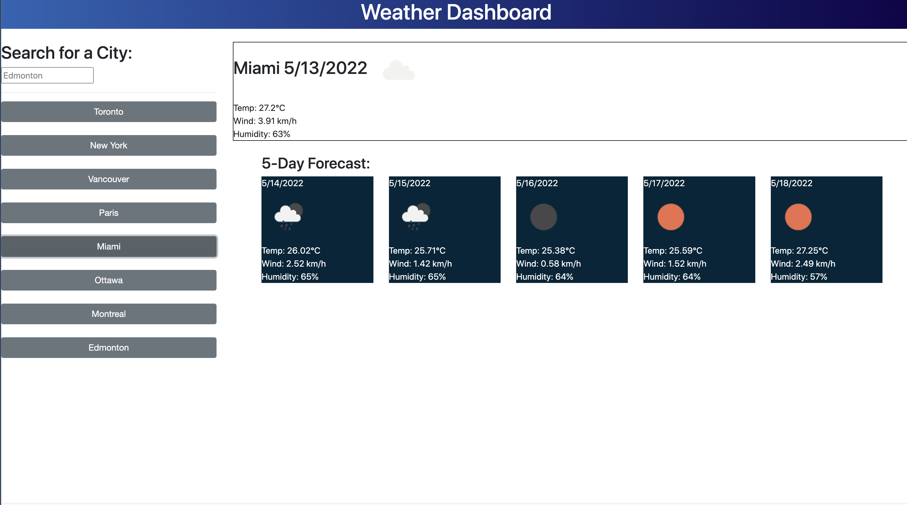

# weatherdata
This app provides users with the ability to search for weather forecasts, and save past searches. Useful for planning a trip.

Link to the [live application](https://michaelpalumbo.github.io/weatherdata/)

Link to [the repository](https://github.com/michaelpalumbo/weatherdata)

NOTE: UV Index is no longer supported by the API

Application screenshot:

